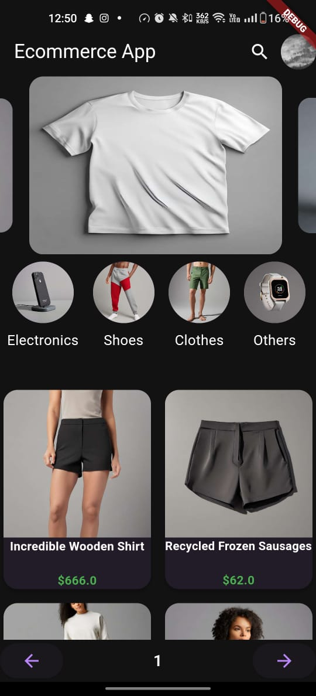
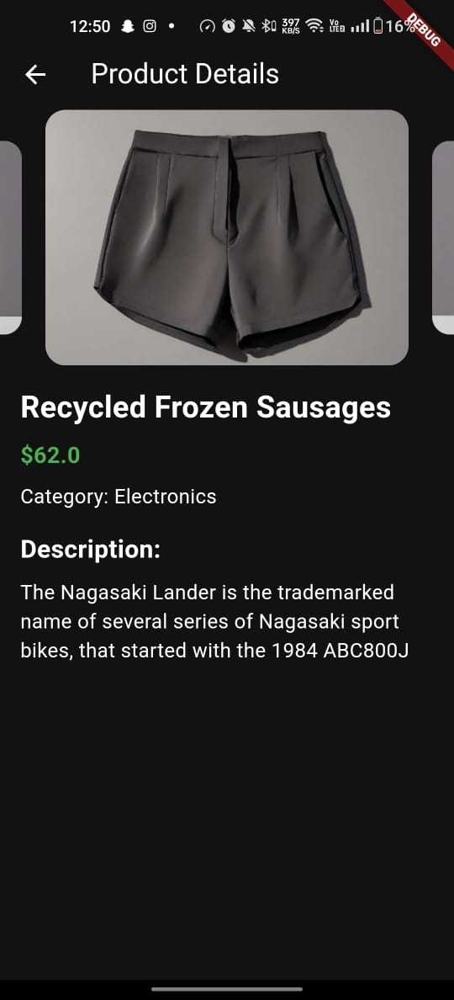
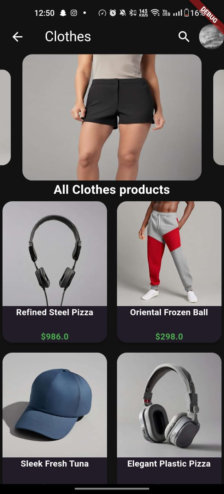

# Flutter E-commerce App

This Flutter app is a complete solution for an e-commerce platform with a focus on code quality, state management using Provider, and API integration .

                 


                 

## Features

- Home screen displaying product categories.
- Category selection to display items.
- Item details screen.
- Panigation as mentioned in api
- State management using Provider.
- API integration for product categories and items.
- Beautiful animations inspired by Dribbble design.
- Unit tests for the app logic (though there may be unresolved errors).

## Setup and Installation

1. Clone this repository to your local machine.
2. Open the project in your preferred Flutter IDE (e.g., Android Studio, VS Code).
3. Ensure you have Flutter and Dart installed.
4. Run the app on an emulator or physical device by executing `flutter run`.

## State Management with Provider

The app utilizes the Provider package for state management. It ensures efficient data sharing and management throughout the application. The provider package allows us to manage and access the app's state easily.

```dart
// Example of how I use Provider to manage state in the app
Provider.of<YourProvider>(context).yourFunction();
```


## Beautiful Animations

I have incorporated beautiful animations into the app, taking inspiration from the Dribbble design. These animations enhance the user experience and create a visually appealing interface.

## Unit Tests

I have implemented unit tests to ensure the correctness of the app's logic. HoIver, some unresolved errors may exist. Unit tests are essential for maintaining the code's quality and ensuring that future changes do not introduce new bugs.


```

## Optional Features

- **Integration Tests:** While I have focused on unit tests, integration tests can be added to ensure that different parts of the app work seamlessly together.

## Restrictions

- **Plagiarism:** I did not copy-paste code from external sources. I understand the importance of code originality and take this policy seriously.
- **Utility Libraries:** I attempted to write most utility functions ourselves, but some boilerplate/scaffolding code may have been used to expedite development.
- **Timely Completion:** The app was completed within the assigned two working days.

**Note:** This README provides an overview of the app and its features. For a more detailed understanding, please refer to the source code.